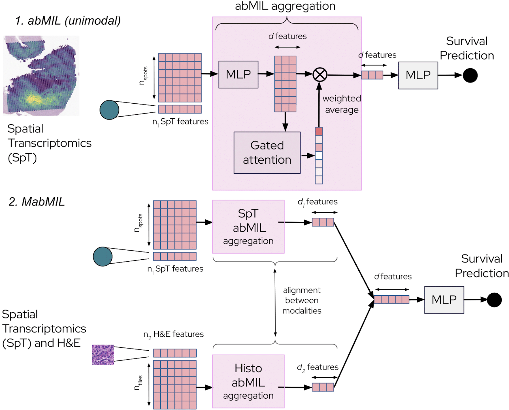

<!-- Title -->
<div align="center">
<h1>Multiple instance learning with spatial transcriptomics for patient-level predictions</h1>

[](https://www.biorxiv.org/content/10.1101/2025.10.13.682206v1) &nbsp;


</div>

## Core components

### Models

SpaMIL aims to adapt the Multiple Instance Learning (MIL) framework, primarily used for the H&E modality, to spatial transcriptomics.
In our work, we also adapted it to single-cell transcriptomics and extended it in several multimodal fashions.
The main PyTorch models (and associated losses) available in the repository are:
- abMIL (attention-based MIL).
- MabMIL (multimodal inference).
- MabMIL (SpT-to-HE distillation).

<div align="center">

</div>

In our benchmark, other models were also considered, and available in the repository:
- Chowder.
- abMIL, multimodal early fusion.
- Chowder, multimodal early fusion.
- Chowder, multimodal late fusion.

They are available in the `spamil.models` module.

### Transforms

In the paper, a *transform* includes both the scaling and the embedding of the data in lower dimension :
- Initial filtering for the number of genes is done first, within each train/validation split (e.g., with Moran's spatially variable index in spatial transcriptomics).
- Some normalizations are part of the consortium's provided data (e.g., TPM for bulk RNAseq data).
- Some others are part of these transforms and are different for each train/validation split (when appropriate), to avoid leakage of data (e.g., median of ratios scaling for bulk RNAseq data).
- Some lower dimension representation learning algorithms are used in a zero-shot fashion (e.g., scGPT-spatial).
- Some others are fitted in every train/validation split (e.g., scVI).

They are available in the `spamil.data.transforms` module.

### Benchmark

The results of the paper were obtained with specific trainer, transform, data and experiment hyperparameters.
This repository includes these `ml_collections` configs, composed of the best trainer, transform and experiment configurations for each modality.

they are available in the `mabmil.experiments.composed` module.

### Other

Additional transforms and models used in the experiments, that are not novalties of the paper include:
- scGPT-spatial features. They were embedded by cloning and following the steps provided by the scGPT-spatial [github repository](https://github.com/bowang-lab/scGPT-spatial).
- H&E extracted features. They were embedded following the steps provided by the H-optimus-0 [hugging face page](https://huggingface.co/bioptimus/H-optimus-0).
- Annotated and deconvolved fractions. Refer to the [MOSAIC pipeline](https://www.biorxiv.org/content/10.1101/2025.05.15.654189v1) and the steps provided by the cell2location [github repository](https://github.com/BayraktarLab/cell2location).
- Cox model. Refer to [lifeline](https://lifelines.readthedocs.io/en/latest/fitters/regression/CoxPHFitter.html).

## Setup

### Installation

This code relies on python 3.10.
To install SpaMIL on a dedicated environment:
```bash
conda create --name spamil_env python=3.10
conda activate spamil_env
pip install -e .
```

### Download data

The data is the property of the [MOSAIC consortium](https://www.mosaic-research.com/).
More particularly, the Glioblastoma data that the paper uses come from the CHUV and Erlangen hospitals and are composed of the following matched modalities:
- Clinical metadata, including clinically relevant predictors (administrative gender, age at diagnosis, MGMT promoter methylation, surgery type).
- Bulk RNAseq data (Illumina).
- H&E slides.
- Single-cell RNAseq data (Chromium).
- Spatial transcriptomics (Visium).

The data curation and preprocessing steps follow the description presented in the [MOSAIC paper](https://www.biorxiv.org/content/10.1101/2025.05.15.654189v1) and in the [SpaMIL paper](https://www.biorxiv.org/content/10.1101/2025.10.13.682206v1).
For the multimodal benchmark, we only kept the matched baseline samples that passed the QCs for data quality, from the *first* batch of samples that were processed by the hospitals.
For the H&E-only distillation evaluation, we used the H&E data coming from the baseline samples that passed the QCs for data quality, from the *second* batch of samples that were processed.

Following MOSAIC consortium guidelines, data will be made available upon reasonable request.

Extend our work!
In addition to Glioblastoma, MOSAIC released multimodal data for several other cancers through the [MOSAIC window initiative](https://ega-archive.org/studies/EGAS50000000689). Feel free to request access to the data and use SpaMIL on these other indications.

## Acknowledgments

We are grateful to patients, physicians, nurses and research assistants involved in the study.
This study makes use of a glioblastoma cohort of the MOSAIC consortium (Owkin; Charité - Universitätsmedizin Berlin (DE); Lausanne University Hospital - CHUV (CH); Universitätsklinikum Erlangen (DE); Institut Gustave Roussy (FR); University of Pittsburgh (USA)), a non-interventional clinical trial registered under NCT06625203.

## Cite

Check out our [preprint](https://www.biorxiv.org/content/10.1101/2025.10.13.682206v1)!
If you found our work useful in your research, please consider citing it at:
```bibtex
@article {Grouard2025.10.13.682206,
	author = {Grouard, Simon, et al.},
	title = {Multiple instance learning with spatial transcriptomics for interpretable patient-level predictions: application in glioblastoma},
	year = {2025},
	doi = {10.1101/2025.10.13.682206},
	URL = {https://www.biorxiv.org/content/early/2025/10/15/2025.10.13.682206},
	journal = {bioRxiv}
}
```
